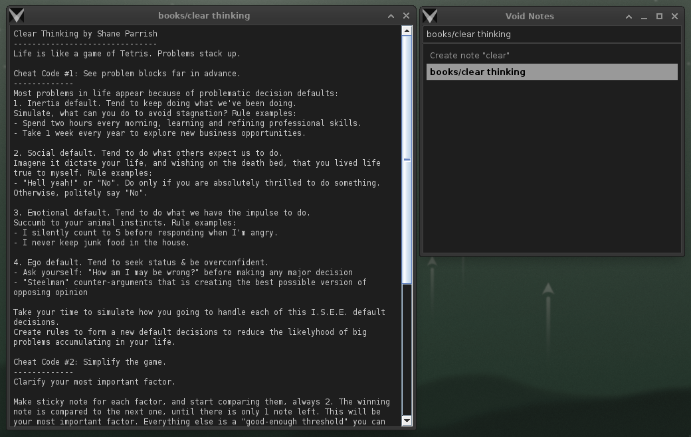
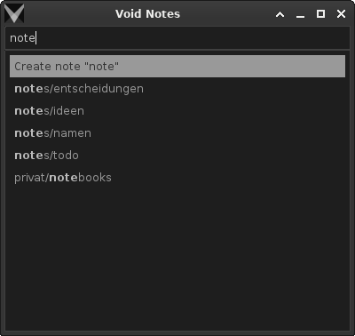
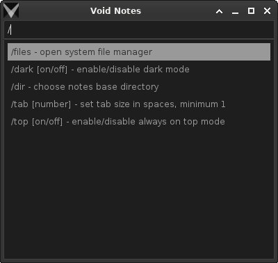

# Void Notes

A note-taking app. Deliberately minimalistic, even ascetic, in features and UI design.
The main idea is to give you a tool where features are limited to the bare minimum, so
you can focus on the content of your notes, on WHAT you write, instead of HOW you write
it.

Don't fool yourself by thinking that you need a fancy app, or some kind of productivity
system to be productive. You don't. A simple text editor, or even a piece of paper is
all you need to get started and get it done. The rest is just procrastination. :wink:

## Installation

Please go to the [Releases](https://github.com/giantvoid/voidnotes/releases) page and
download the latest version for your OS.

## Features

- Plain text notes stored in a user defined directory (default: `~/VoidNotes`). Just a
usual folder with `.txt` files. Feel free to edit them with any other text editor.
- A simple window for finding and opening notes.
- Very keyboard-oriented.
- Immediate saving of notes. No save button. No auto-save. Just type and close the window
with `Esc` when you're done.
- Dark mode. Type `/dark on` or `/dark off` in the search field and press `Enter` to
enable or disable it.
- System tray icon. Click on it to open the search window. Right-click to open a context
menu with a few options.

Use relative path if you want to create a note in a subdirectory. For example, if you
want to create a note `todo` in directory `[NOTES_DIRECTORY]/projects/first app`, just
type `projects/first app/todo` in the search field and press `Enter`.

To hide tool windows in their current state even when always on top is enabled, use
`Shift + Esc`. It works almost the same way as `Cmd + H` on macOS.

Tested and optimized for: Linux, Windows, macOS, and Raspberry Pi.

## Search Window

Just start typing. Press `Enter` to create and open a new note with the search term as
title. If a note with the search term as title already exists, it will be displayed in
the selection list. Navigate the list with the arrow keys (`Up` and `Down`) and press
`Enter` to confirm your selection.

There are a few special commands that can be entered in the search field. They all start
with a slash (`/`).

As Void Notes doesn't have such features as rename, delete, or move, you can use the
file manager of your OS to do that. Just open the notes directory (type in `/files` and
press `Enter` in the search field) and use the opened file manager of your system  to
rename, delete, and do whatever you want.

## Editor

Everything you type is saved immediately. There is no save button. There is no
auto-save. Just type and close the window with `Esc` when you're done.

If you want to hide both editor and search windows in their current state, use
`Shift + Esc`.

The editor supports a few keyboard shortcuts, besides the usual ones such as `Ctrl + C`
for copy, `Ctrl + V` for paste etc.

| Shortcut      | Description                    |
|---------------|--------------------------------|
| `Ctrl + M`    | Toggle monospaced font on/off  |
| `Ctrl + +`    | Increase font size             |
| `Ctrl + -`    | Decrease font size             |
| `Esc`         | Close editor window            |
| `Shift + Esc` | Hide editor and search windows |

## Configuration

The configuration file created automatically when you start Void Notes for the first
time. You can edit it with any text editor.

| OS      | Path to config file                                    |
|---------|--------------------------------------------------------|
| Linux   | `~/.config/VoidNotes/settings.txt`                     |
| Windows | `%APPDATA%\Roaming\VoidNotes\settings.txt`             |
| macOS   | `~/Library/Application Support/VoidNotes/settings.txt` |

It is well commented, but, to be honest, there is not much to configure. Just the
settings described in the text above, plus the option to disable the system tray icon.